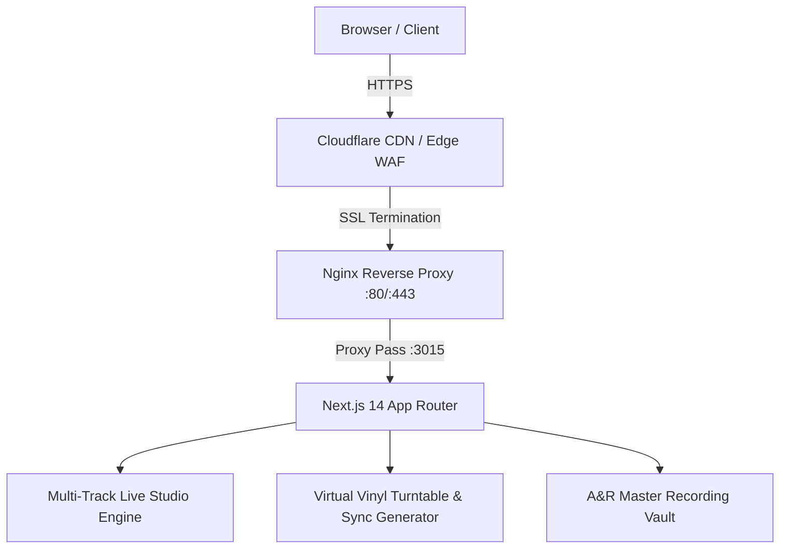

# Architecture & Engineering Specifications — YALINIZ Records

## 1. System Topology

## 2. Technical Stack
- **Framework**: Next.js 14.2+ (App Router, Server & Client Components)
- **Language**: TypeScript 5.6+
- **Styling**: Tailwind CSS 3.4+ (Custom Golden Luxury & Darkroom Palette)
- **Icons**: Lucide React
- **Motion**: Framer Motion 11+
- **Font Stack**: Playfair Display (Serif Headings), Inter (Sans Body), JetBrains Mono (Telemetry)

## 3. Audio & Analog Emulation Design
- High-fidelity canvas/SVG procedural turntable rendering.
- Real-time audio reactive visualizer and multi-track channel fader telemetry.
- Form validation with zero external unverified third-party dependencies.\n